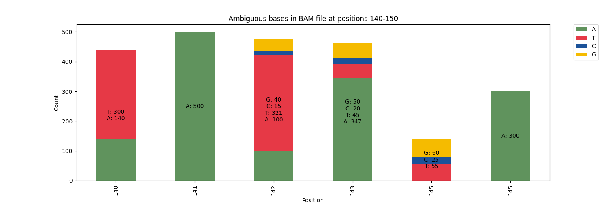

# Ambigviz


Recently re-wrote this in rust due to performance issues when handling large BAM files - a lot faster and more feature complete:
[ambigviz.rs](https://github.com/Sam-Sims/ambigviz)

ambigviz is a Python tool that allows you to visualise mixed bases at given positions in a BAM file. Initially written as a quick way to produce plots for examining co-infection/contamination/sequencing errors in SARS-CoV-2 sequences.

It provides a simple command-line interface for specifying the input BAM file and the desired positions to visualise. The tool generates a bar plot showing the distribution of nucleotide bases (A, T, C, G) at the specified positions.

## Installation

1. Clone the repository:

   ```
   git clone https://github.com/sam-sims/ambigviz.git
   ```

2. Install the required dependencies:

   ```
   pip install -r requirements.txt
   ```

## Usage

```
python bam_visualiser.py -b <bam_file> [options]
```
If the input BAM file has not been indexed, ambigviz will attempt to index it first.

### Arguments

- `-b`, `--bam`: **(required)** Path to the input BAM file.
- `--positions`: Positions to visualise (comma-separated).
- `--start_pos`: Start position to visualise.
- `--end_pos`: End position to visualise.
- `--percentages`: Show percentages instead of counts.
- `--min_depth`: Minimum depth to include a nucleotide in the plot (default: 0).
- `--save_counts`: Save counts to a CSV file. Provide a path
- `--fig_width`: Adjust the width of the figure (default: 20).
- `--individual_annotations`: Show individual annotations.
- `--output`: Location for output plot (default: pileup.png)

## Example Commands

1. Visualise specific positions:

   ```
   python bam_visualiser.py -b input.bam --positions 140,145 --min_depth 10
   ```

2. Visualise a range of positions, and plot the proportions:

   ```
   python bam_visualiser.py -b input.bam --start_pos 100 --end_pos 200 --percentages
   ```

3. Save counts to a CSV file:

   ```
   python bam_visualiser.py -b input.bam --positions 150 --save_counts counts.csv
   ```

## Example plots:

Default: 


Using `--individual_annotations`:


## Version

- 0.1.2
